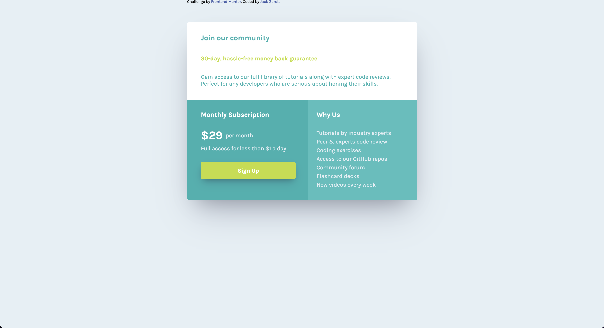
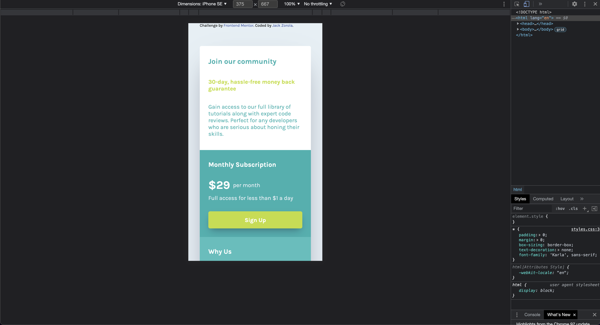

# Frontend Mentor - Single price grid component solution

This is a solution to the [Single price grid component challenge on Frontend Mentor](https://www.frontendmentor.io/challenges/single-price-grid-component-5ce41129d0ff452fec5abbbc). Frontend Mentor challenges help you improve your coding skills by building realistic projects. 

## Table of contents

- [Overview](#overview)
  - [The challenge](#the-challenge)
  - [Screenshot](#screenshot)
  - [Links](#links)
- [My process](#my-process)
  - [Built with](#built-with)
  - [Continued development](#continued-development)
  - [Useful resources](#useful-resources)
- [Author](#author)
- [Acknowledgments](#acknowledgments)

## Overview

### The challenge

Users should be able to:

- View the optimal layout for the component depending on their device's screen size
- See a hover state on desktop for the Sign Up call-to-action

### Screenshot

### Links

- Solution URL: (https://github.com/jackzorola10/single-price-grid-component-master)
- Live Site URL: (https://jackzorola10.github.io/single-price-grid-component-master/)

## My process

- I first created the HTML structure based on the contents of the image. 
  - In retrospective, since the larger challenge for me was the repsonsiveness, I'm wondering it maybe next time I should start there even if there's no content yet. Might have solved some of the harder questions first maybe (?). 
- I then went ahead and created some basic naming for the classes and made sure to separate them on the css doc.
- Worked on givign the different styles and colors.
- Finally reviewed the responsiveness, I used grids for this and flexbox for some minor sections inside each of the three sections.
  - Worked first on the mobile version and worked my way up. 

### Built with

- Semantic HTML5 markup
- CSS custom properties
- Flexbox
- CSS Grid
- Mobile-first workflow

### Continued development

I'm particularly worried about if my projects are easy to read and if there's anything I can do to make them more escalable. 

### Useful resources

- [GRID: A simple visual cheatsheet for CSS Grid Layout](https://grid.malven.co) -  I used this cheatsheet for how to use Grids.
- [CSS Flexbox Cheatsheet](https://marketplace.visualstudio.com/items?itemName=dzhavat.css-flexbox-cheatsheet) - Awesome resource to quickly remember how flexbox works.
- [Beautiful CSS box-shadow examples](https://getcssscan.com/css-box-shadow-examples) - Great resource to give you quick and easy shadows. 

## Author

- Website - [Jack Zorola](https://github.com/jackzorola10)
- Frontend Mentor - [@jackaorola10](https://www.frontendmentor.io/profile/jackzorola10)
- Twitter - [@jackzorola](https://www.twitter.com/jackzorola)
- Spotify - [@KayVstheMoon](https://open.spotify.com/artist/1lPbVyRwZyaT3O1JeDRyTY)

## Acknowledgments

I want to acknowledge my dogs, who gave me support during these hard times:
- Licho
- Amanda
